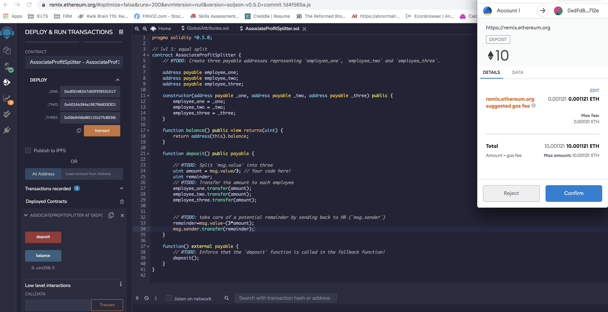
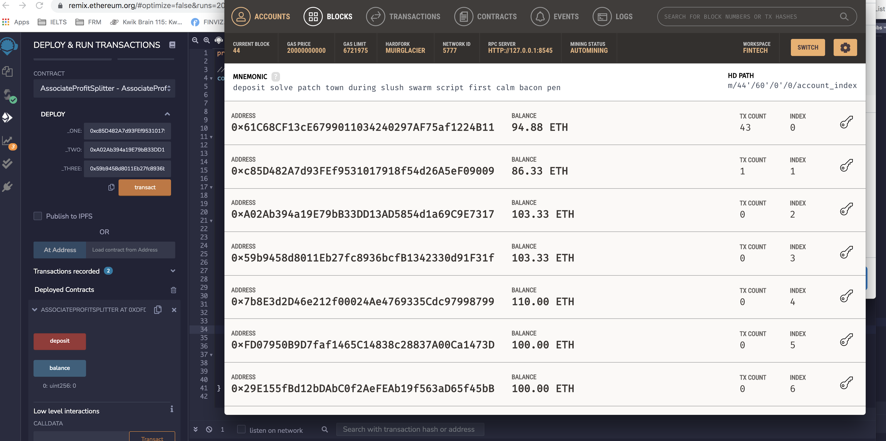
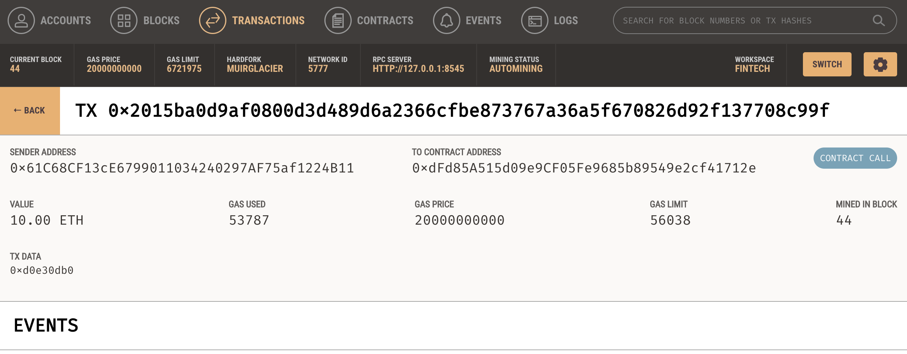
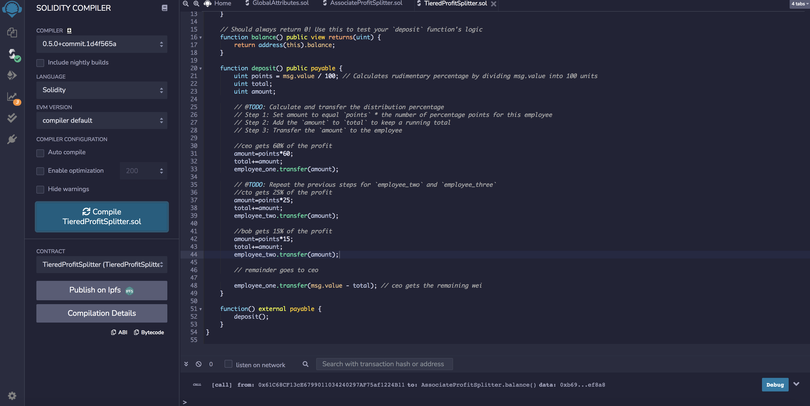
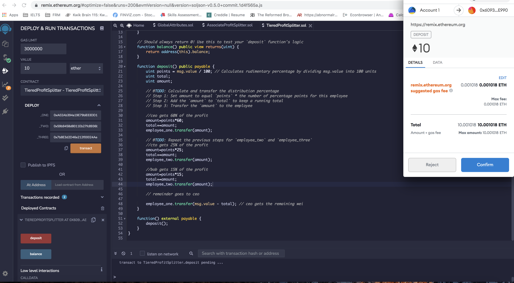
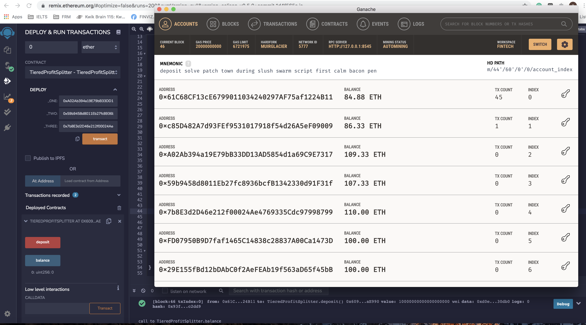
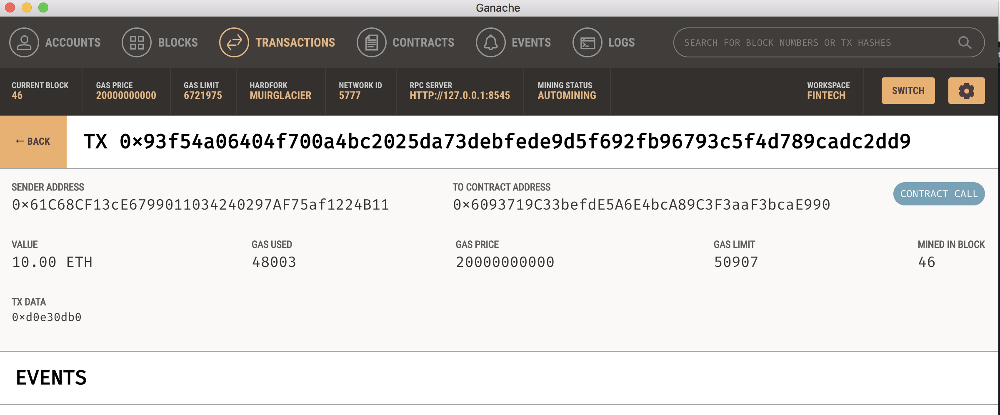

# **Looks like we have made our first smart contract**
---

---
## **Background**

A new startup has created its own Ethereum-compatible blockchain to help connect financial institutions, and the team wants to build smart contracts to automate some company finances to make everyone's lives easier, increase transparency, and to make accounting and auditing practically automatic.

---
## **Objective**
To create `ProfitSplitter` smart contracts that will:

* Pay your associate-level employees quickly and easily.

* Distribute profits to different tiers of employees.

---
## **Libraries/Tools/Apps**

* Solidity
* Remix IDE
* Ganache
* Metamask

---
## **Code**

* [`AssociateProfitSplitter.sol`](AssociateProfitSplitter.sol) — Level 1 

* [`TieredProfitSplitter.sol`](TieredProfitSplitter.sol) — Level 2 

---

## **Outputs**

1. **AssociateProfitSplitter**  

    * Transferring 10 ETH to the contract through deposit function  

        

        `Employee One Address` :`0xc85D482A7d93FEf9531017918f54d26A5eF09009`   
        `Employee Two Address` :`0xA02Ab394a19E79bB33DD13AD5854d1a69C9E7317`   
        `Employee Three Address` :`0x59b9458d8011Eb27fc8936bcfB1342330d91F31f`  

    * Remix Transaction details  

        

    * Ganache  

        

     * Ganache Block Transaction  

          

    ---
       

2. **TieredProfitSplitter**  

    * Compling the TieredProfitSplitter contract  

        

    * Transferring 10 ETH to the contract through deposit function  

        

        `Employee One Address (CEO)` :`0xA02Ab394a19E79bB33DD13AD5854d1a69C9E7317`   
        `Employee Two Address (CTO)` :`0x59b9458d8011Eb27fc8936bcfB1342330d91F31f`   
        `Employee Three Address (Bob)` :`0x7b8E3d2D46e212f00024Ae4769335Cdc97998799`    

    * Remix Transaction details  

        

    * Ganache  

        

     * Ganache Block Transaction  

        

----
